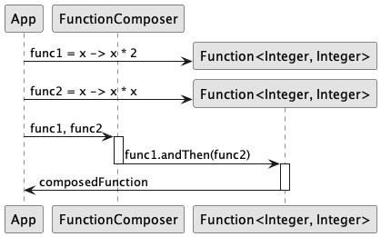

## Name / classification

Function Composer

## Also known as

Functional Composition

## Intent
To enable creating complex functions by composing simpler ones, enhancing modularity and reusability of function-based logic.

## Explanation

Real-world example:

> In financial software, functions that calculate various financial metrics can be composed to provide detailed analysis. For instance, a function that calculates interest can be composed with another that adjusts for taxes, allowing for a modular yet comprehensive financial assessment tool.

In plain words:

> The Function Composer pattern allows building complex functions by combining simpler ones, making it easier to manage, test, and reuse individual pieces of functionality.

Wikipedia says:

> Function composition is an act or mechanism to combine simple functions to build more complicated ones. Like the usual composition of functions in mathematics, the result of each function is passed as the argument of the next, and the result of the last one is the result of the whole.

**Programmatic Example**

Here is how the Function Composer pattern might be implemented and used in Java:

```java
public class FunctionComposer {

    public static Function<Integer, Integer> composeFunctions(Function<Integer, Integer> f1, Function<Integer, Integer> f2) {
        return f1.andThen(f2);
    }
}
```
```java
public class App {
    public static void main(String[] args) {
        Function<Integer, Integer> timesTwo = x -> x * 2;
        Function<Integer, Integer> square = x -> x * x;

        Function<Integer, Integer> composedFunction = FunctionComposer.composeFunctions(timesTwo, square);

        int result = composedFunction.apply(3);
        logger.info("Result of composing 'timesTwo' and 'square' functions applied to 3 is: " + result);
    }
}
```

Result:
```
Result of composing 'timesTwo' and 'square' functions applied to 3 is: 36 // Result will be 36 (3 * 2 = 6, 6 * 6 = 36)
```

Use ``.compose()`` function when you need pre-compose and ``.andThen()`` function when you need post-compose.

## Sequence diagram



## Applicability

Use the Function Composer pattern when:

* You want to create a pipeline of operations where the output of one function is the input to another.
* You need to enhance the clarity and quality of your code by structuring complex function logic into simpler, reusable components.
* You are working in a functional programming environment or a language that supports higher-order functions.

## Tutorials

[Function Composition in Java](https://functionalprogramming.medium.com/function-composition-in-java-beaf39426f52)

## Known uses

* Stream processing in Java 8 and above
* Query builders in ORM libraries
* Middleware composition in web frameworks

## Consequences

Benefits:

* High reusability of composed functions.
* Increased modularity, making complex functions easier to understand and maintain.
* Flexible and dynamic creation of function pipelines at runtime.
* 
Drawbacks:

* Potentially higher complexity when debugging composed functions. 
* Overhead from creating and managing multiple function objects in memory-intensive scenarios.

## Related patterns

* Chain of Responsibility
* Decorator
* Strategy

## Credits

[Functional Programming in Java](https://www.baeldung.com/java-functional-programming)
[Function Composition in Java](https://functionalprogramming.medium.com/function-composition-in-java-beaf39426f52)
